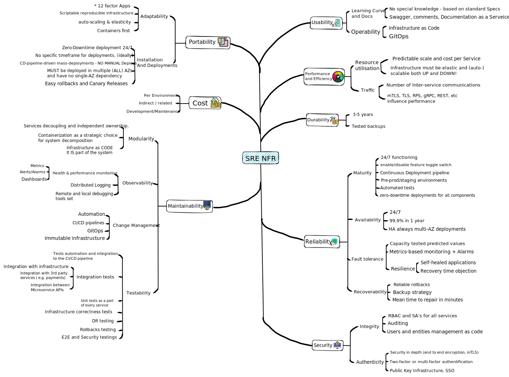

## SRE or Project Non-Functional Requirements Template
Non-Functional Requirements or (NFRs) could be used to create a secure, maintainable, scalable, reliable, portable and cost effective product or project. Content could be used as a source what could be done and not how it could be done, a lot of topics are interchangeable.  

### Table of contents:
* Usability
* Cost
* Maintainability
* Portability
* Security
* Reliability
* Durability
* Performance & Efficiency
### Sorce content
Repository will consists of `svg` image for the mind map template, and `.excalidraw` source file which could be used to change and evolv existing template. 
